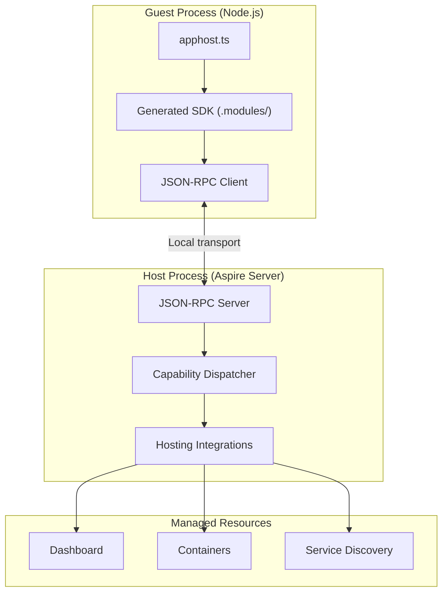

Aspire supports writing AppHosts in multiple languages. While the orchestration engine is built on .NET, a guest/host architecture allows AppHosts written in TypeScript today, and additional languages in the future, to access Aspire integrations, service discovery, and the dashboard.

## Why a shared backend

Aspire's hosting integrations and deployment publishers are written in .NET and have already accumulated the runtime behavior needed for local orchestration, diagnostics, and publishing. Rewriting those integrations for every guest language would duplicate a large amount of behavior and significantly increase maintenance cost.

Instead, guest languages only declare resources such as `addRedis`, `addPostgres`, and `withReference`, while the .NET host handles orchestration concerns such as starting containers, wiring service discovery, running health checks, and generating deployment artifacts. The trade-off is a local IPC hop, which is much cheaper than maintaining the same integration surface independently in multiple languages.

## Guest/host model

When you run a TypeScript AppHost, the Aspire CLI orchestrates two processes:

- **Guest**: your `apphost.ts` process, running in Node.js
- **Host**: the Aspire orchestration server, running on .NET

The guest communicates with the host via JSON-RPC over a local transport: Unix sockets on macOS and Linux, and named pipes on Windows. Your code calls methods such as `addRedis()` or `withReference()`, and the generated SDK translates those calls into RPC requests.

## Startup sequence

1. The CLI prepares the host process with the required hosting packages.
2. The ATS scanner inspects assemblies for exports and generates the TypeScript SDK into `.modules/`.
3. The CLI starts the host process and creates the local socket or pipe endpoint.
4. The CLI starts the guest process and passes connection details through environment variables.
5. The guest connects and invokes capabilities such as `createBuilder`, `addRedis`, `build`, and `run`.
6. The host orchestrates resources, starts the dashboard, and manages the application lifecycle.

## Token-based authentication

The guest process authenticates to the host with a one-time token generated for that session and passed through environment variables at startup. The local transport is also protected by operating system file permissions, so only processes running as the same user can connect. There are no public network ports involved in guest-to-host communication.

## Aspire Type System

The Aspire Type System, or ATS, is the contract that bridges .NET and guest languages. Every exported type that crosses the boundary gets a portable type identity derived from its assembly and type name.

### Type categories

| Category | Description | Serialization |
|----------|-------------|---------------|
| **Primitive** | `string`, `int`, `bool`, `double`, and similar scalar types | JSON native values |
| **Enum** | .NET enum types | String member names |
| **Handle** | Opaque references to host-side objects | JSON handle envelopes |
| **DTO** | Data transfer objects marked for export | JSON objects |
| **Callback** | Guest-provided delegate functions | Callback identifiers |
| **Array** | Immutable collections | JSON arrays |
| **List / dictionary** | Mutable collections | Handles for properties, JSON for parameters |

### How ATS maps to TypeScript

| .NET type | TypeScript representation |
|----------|---------------------------|
| Primitives | Native TypeScript primitives |
| Enums | String literal unions |
| Resource types | Typed handle objects with fluent methods |
| DTOs | Interfaces serialized as JSON |
| Collections | Arrays and `Record<string, T>` |
| Delegates | Async callback functions |

Resource types are passed by handle. The actual instance remains in the host process, while the TypeScript SDK keeps a reference and dispatches method calls as JSON-RPC requests.

## Polymorphism flattening

.NET APIs rely on inheritance, interfaces, and generics. Guest SDKs do not need to expose that full shape directly. During scanning, ATS flattens the exported type system so the generated guest API is easier to consume:

- Concrete types receive the full set of applicable capabilities.
- Interface relationships are expanded into directly callable members.
- Generic constraints are resolved into exportable concrete surfaces.

That flattening means a resource such as `RedisResource` can expose fluent methods from shared interfaces alongside Redis-specific APIs without requiring guest languages to model the original inheritance tree.

## SDK generation

The TypeScript SDK is generated from hosting integration assemblies. When you add an integration with `aspire add`, the CLI:

1. Loads the integration assembly.
2. Scans exported methods and types.
3. Applies ATS rules, including polymorphism flattening.
4. Emits typed TypeScript wrappers into `.modules/`.

This keeps the SDK in sync with the .NET implementation. Integration authors do not hand-write TypeScript bindings; they export their .NET APIs and the CLI generates the guest surface automatically.

## Same model, different syntax

The AppHost model is the same regardless of language. A TypeScript AppHost defines the same resources, references, and dependency graph as a C# AppHost. The difference is the authoring syntax.

| Concept | C# | TypeScript |
|---------|----|------------|
| Create builder | `DistributedApplication.CreateBuilder(args)` | `await createBuilder()` |
| Add resource | `builder.AddRedis("cache")` | `await builder.addRedis("cache")` |
| Reference | `.WithReference(db)` | `.withReference(db)` |
| Wait for | `.WaitFor(api)` | `.waitFor(api)` |
| Build and run | `builder.Build().Run()` | `await builder.build().run()` |

The resulting dashboard, service discovery behavior, health checks, and deployment artifacts come from the same host-side orchestration engine.

## See also

- [Build your first app](/docs/get-started/first-app/first-app-typescript-apphost) — get started with a TypeScript AppHost
- [Resource model](/docs/architecture/resource-model) — understand how Aspire models resources and relationships
- [Multi-language integrations](/docs/extensibility/multi-language-integration-authoring) — make your integration work with multi-language AppHosts
