In this tutorial, you take the app you created in the [Build your first Aspire app — TypeScript AppHost](/docs/get-started/first-app/first-app-typescript-apphost) quickstart and deploy it. This can be broken down into several key steps:


<Steps>
<Step stepNumber="1">
[Add deployment package](#add-deployment-package) — Add the hosting package for your target.

</Step>
<Step stepNumber="2">
[Update your AppHost](#update-your-apphost) — Configure the environment API.

</Step>
<Step stepNumber="3">
[Deploy your app](#deploy-your-app) — Deploy using the Aspire CLI.

</Step>
<Step stepNumber="4">
[Verify your deployment](#verify-your-deployment) — Ensure your app is running as expected.

</Step>
<Step stepNumber="5">
[Clean up resources](#clean-up-resources) — Remove any deployed resources to avoid incurring costs.

</Step>
</Steps>

The following diagram shows the architecture of the sample app you're deploying:

```mermaid
architecture-beta
  group docker(logos:docker-icon)[NodeJS and static site server container]

  service api(logos:nodejs-icon)[API service] in docker
  service http(iconoir:server-connection)[https] in docker
  service frontend(logos:react)[React front end] in docker

  frontend:L --> R:http
  http:L --> R:api
```



The React (Vite) & Express starter template consists of two resources that are deployed as a single container. The Express server hosts both the API and the static frontend files generated by React.

## Prerequisites

Depending on where you want to deploy your Aspire app, ensure you have the following prerequisites installed and configured:


**Docker Compose**

- [Docker Desktop](https://www.docker.com/products/docker-desktop) installed and running.
- [Podman (alternative to Docker)](https://podman.io/getting-started/installation) installed and running. For more information, see [OCI-compatible container runtime](/docs/get-started/setup-and-tooling/prerequisites/#install-an-oci-compliant-container-runtime).

**Azure**

- An [Azure account](https://azure.microsoft.com/free/) with an active subscription.
- [Azure CLI](https://learn.microsoft.com/cli/azure/install-azure-cli) installed and configured. You should be logged in using `az login`.
  


## Add deployment package

In the root directory of your Aspire app that you created in the previous quickstart, add the appropriate hosting deployment package by running the following command in your terminal:


**Docker Compose**

        [Docker Compose](https://docs.docker.com/compose/) is a tool for defining and running multi-container Docker applications. It allows you to use a YAML file to configure your application's services, networks, and volumes, making it easier to manage and deploy complex applications locally or in various environments.

        ```bash title="Aspire CLI — Add Docker Compose"
        aspire add docker
        ```

        The Aspire CLI is interactive, be sure to select the appropriate search result for the [📦 Aspire.Hosting.Docker](https://www.nuget.org/packages/Aspire.Hosting.Docker) version you want to add.

    
**Azure**

        ```bash title="Aspire CLI — Add Azure App Containers"
        aspire add azure-appcontainers
        ```

        The Aspire CLI is interactive, be sure to select the appropriate search result for the [📦 Aspire.Hosting.Azure.AppContainers](https://www.nuget.org/packages/Aspire.Hosting.Azure.AppContainers) version you want to add.

    

    If prompted for additional selections, use the and keys to navigate the options. Press to confirm your selection.

    ## Update your AppHost

In the AppHost, chain a call to the appropriate environment API method to configure the deployment environment for your target.


**Docker Compose**

        ```typescript title="TypeScript — apphost.ts" {5-6}
        import { createBuilder } from './.modules/aspire.js';

        const builder = await createBuilder();

        // Add the following line to configure the Docker Compose environment
        await builder.addDockerComposeEnvironment("env");

        const app = await builder
            .addNodeApp("app", "./api", "src/index.ts")
            .withHttpEndpoint({ env: "PORT" })
            .withExternalHttpEndpoints();

        const frontend = await builder
            .addViteApp("frontend", "./frontend")
            .withReference(app)
            .waitFor(app);

        await app.publishWithContainerFiles(frontend, "./static");

        await builder.build().run();
        ```

        - `addDockerComposeEnvironment` — Configures the Docker Compose environment for deployment. This call implicitly adds support for containerizing resources in the AppHost as part of deployment.
        - `withExternalHttpEndpoints` — Exposes HTTP endpoints for the resource when deployed.

    
**Azure**

        ```typescript title="TypeScript — apphost.ts" {5-6}
        import { createBuilder } from './.modules/aspire.js';

        const builder = await createBuilder();

        // Add the following line to configure the Azure App Container environment
        await builder.addAzureContainerAppEnvironment("env");

        const app = await builder
            .addNodeApp("app", "./api", "src/index.ts")
            .withHttpEndpoint({ env: "PORT" })
            .withExternalHttpEndpoints();

        const frontend = await builder
            .addViteApp("frontend", "./frontend")
            .withReference(app)
            .waitFor(app);

        await app.publishWithContainerFiles(frontend, "./static");

        await builder.build().run();
        ```

        - `addAzureContainerAppEnvironment` — Configures the Azure App Container environment for deployment. This call implicitly adds support for containerizing resources in the AppHost as part of deployment.
        - `withExternalHttpEndpoints` — Exposes HTTP endpoints for the resource when deployed.

    


> [!TIP] CLI protip
> After installing a new deployment package, you can run `aspire do diagnostics`
> in your terminal to see the available deploy steps. For more information, see
> the [aspire do diagnostics](/reference/cli/commands/aspire-do) reference
> docs.

## Deploy your app

Now that you've added the deployment package and updated your AppHost, you can deploy your Aspire app.


**Docker Compose**

    Deploying to Docker Compose builds the container images and starts the services locally using Docker Compose.

    ```bash title="Aspire CLI — Deploy your app"
    aspire deploy
    ```

    Consider the following example output:

**Azure**

    When deploying to Azure, the `aspire deploy` command is interactive. To avoid prompts (for example, when running in CI/CD), set the following environment variables:

    - `Azure__SubscriptionId`: Target Azure subscription ID.
    - `Azure__Location`: Azure region (for example, eastus).
    - `Azure__ResourceGroup`: Resource group name to create or reuse.

    Deploying to Azure App Containers builds the container images and deploys the services to Azure App Containers.

    ```bash title="Aspire CLI — Deploy your app"
    aspire deploy
    ```

    Consider the following example output:

    When you call `aspire deploy`, the Aspire CLI builds the container images for your resources, pushes them to the target environment (if applicable), and deploys the resources according to the configuration in your AppHost.

> [!NOTE] Common pitfall...
> If you call `aspire deploy` and you see output similar to the following, be sure that you've actually [updated your AppHost](#update-your-apphost) to include the appropriate environment API for your target. This output indicates that there are no deploy steps configured for your target environment.
>
> ```bash title="Aspire CLI - Empty deployment output"
> 14:17:26 (pipeline execution) → Starting pipeline execution...
> 14:17:26 (deploy) → Starting deploy...
> 14:17:26 (deploy) ✓ deploy completed successfully
> 14:17:26 (pipeline execution) ✓ Completed successfully
> ------------------------------------------------------------
> ✓ 2/2 steps succeeded • Total time: 0.0s
>
> Steps Summary:
> 0.0 s  ✓ pipeline execution
> 0.0 s  ✓ deploy
>
> ✓ PIPELINE SUCCEEDED
> ------------------------------------------------------------
> ```

### Post deployment output

After a deployment, the Aspire CLI writes to the provided output path (or the default output path if none is provided) a set of files based on your deployment target. This may include files such as Docker Compose files, Kubernetes manifests, or cloud provider-specific configuration files.


**Docker Compose**

        The `aspire-output` directory contains the generated environment variables, an `app.Dockerfile`, and the Docker Compose configuration. The best part is, these files are opaque to you as a developer—you don't need to write them yourself!

        The `app.Dockerfile` is generated as a multi-stage Dockerfile to build the Express API and also serve the React front end:

        ```dockerfile title="./aspire-output/app.Dockerfile"
        ARG FRONTEND_IMAGENAME=frontend:latest

        FROM node:22-slim AS builder

        WORKDIR /app

        COPY package*.json ./
        RUN npm ci --production

        COPY . .

        FROM ${FRONTEND_IMAGENAME} AS frontend_stage

        FROM node:22-slim AS app

        COPY --from=frontend_stage /app/dist /app/./static
        COPY --from=builder /app /app

        USER node
        WORKDIR /app
        ENTRYPOINT ["node", "--import", "tsx", "src/index.ts"]
        ```

        Finally, the `docker-compose.yaml` file defines the service:

        ```yaml title="./aspire-output/docker-compose.yaml"
        services:
          env-dashboard:
            image: "mcr.microsoft.com/dotnet/nightly/aspire-dashboard:latest"
            expose:
            - "18888"
            - "18889"
            networks:
            - "aspire"
            restart: "always"
          app:
            image: "${APP_IMAGE}"
            environment:
            PORT: "8000"
            OTEL_EXPORTER_OTLP_ENDPOINT: "http://env-dashboard:18889"
            OTEL_EXPORTER_OTLP_PROTOCOL: "grpc"
            OTEL_SERVICE_NAME: "app"
            ports:
            - "8000"
            networks:
            - "aspire"
        networks:
          aspire:
            driver: "bridge"
        ```

    
**Azure**

    After deploying to Azure App Containers, the Aspire CLI saves the deployment state file to your local machine.

        > [!TIP] AppHost SHA256
> The deployment state is saved in a directory named after the SHA256 hash of your full AppHost path. This ensures that deployments for different applications or versions are kept separate.

    


## Verify your deployment


To verify that your application is running as expected after deployment, follow the instructions for your chosen deployment target below.


**Docker Compose**

        When deploying to Docker Compose, the `aspire deploy` command displays the URLs where your services are running. Look for the `print-*-summary` steps in the deployment output, which show the localhost URLs for each service that has been configured with `withExternalHttpEndpoints`.

        In the deployment output, you'll see lines similar to the following:

        ```bash title="Aspire CLI - Deployment summary"
        13:24:13 (print-env-dashboard-summary) i [INF] Successfully deployed env-dashboard to http://localhost:54633.
        13:24:13 (print-app-summary) i [INF] Successfully deployed app to http://localhost:54463.
        ```

        Open your web browser and navigate to the URL shown for your app (for example, `http://localhost:54463`) to see your deployed application.

        The front end displays the weather forecast data in a stunning React template. In this example, both the API service and the React front end are running within the same Docker container.

    

**Azure**

        When deploying to Azure App Containers, you can verify that your Express/React application is running by navigating to the URL provided in the deployment output. Look for a line similar to the following in the output:

        ```bash title="Aspire CLI - Deployment summary"
        09:25:29 (print-app-summary) i [INF] Successfully deployed app to
            https://{NAME}.{LOCATION}.azurecontainerapps.io
        ```

        Open your web browser and navigate to the provided URL to see your deployed application.

        The front end displays the weather forecast data in a stunning React template. In this example, both the API service and the React front end are running within the same Docker container.

    


## Clean up resources

After deploying your application, it's important to clean up resources to avoid incurring unnecessary costs or consuming local system resources.


**Docker Compose**
        To clean up resources after deploying with Docker Compose, you can stop and remove the running containers using the following command:

        ```bash title="Aspire CLI - Stop and remove containers"
        aspire do docker-compose-down-env
        ```
    
**Azure**
        To clean up resources after deploying to Azure, you can use the Azure CLI to delete the resource group that contains your application. This will remove all resources within the resource group.

        ```bash title="Azure CLI - Delete resource group"
        az group delete --name <RESOURCE_GROUP_NAME> --yes --no-wait
        ```
    


You've just built your first Aspire app and deployed it to production—congratulations! 🎉 Now you might be wondering: "How do I make sure all these services actually work together correctly?" That's where integration testing comes in. Aspire makes it easy to test your entire application stack, including service-to-service communication and resource dependencies. Ready to learn how? [Write your first test](/docs/testing/write-your-first-test)
