This quickstart uses the JavaScript starter template, which generates a TypeScript AppHost in `apphost.ts`. You'll create the solution, review the generated TypeScript AppHost, and run it locally with Aspire.

This starter template combines a modern JavaScript stack:

- [Express](https://expressjs.com/) for building APIs with Node.js
- [React](https://react.dev/) for building user interfaces with JavaScript
- [TypeScript](https://www.typescriptlang.org/) for type-safe development across the entire stack

The following diagram shows the architecture of the sample app you're creating:

```mermaid
architecture-beta
  service api(logos:nodejs-icon)[API service]
  service frontend(logos:react)[React front end]

  frontend:L --> R:api
```




## Create a new app

To create your first Aspire application, use the [Aspire CLI](/docs/get-started/setup-and-tooling/install-cli) to generate a new solution from a _starter_ template. These template include multiple projects, such as an API service, a web frontend, and an [Aspire AppHost](/docs/fundamentals/core-concepts/app-host).


<Steps>
<Step stepNumber="1">
Create a new Aspire solution from a template:


```bash title="Create a new aspire solution"
aspire new aspire-ts-starter -n aspire-app -o aspire-app
```

The template provides several projects, including an API service, web frontend, and AppHost.

> [!TIP] CLI flags
> The following flags are used in the command:
>
> - `-n`: specifies the name of the solution.
> - `-o`: specifies the output directory.

If prompted for additional selections, use the and keys to navigate the options. Press to confirm your selection.

> [!NOTE] AI agent environments
> When prompted "Would you like to configure AI agent environments for this project?", select `y`. This sets up workspace configurations (such as the Aspire skill file and MCP server settings) for your project, enabling a richer experience with AI coding assistants. For more information, see [Use AI coding agents](/docs/get-started/ai-coding-agents) and the [`aspire agent init`](/reference/cli/commands/aspire-agent-init) reference.

</Step>
</Steps>

## Review the template code

<Steps>
<Step stepNumber="1">
Examine the created template structure. The Aspire CLI creates a new folder with the name you provided in the current directory. This folder contains the solution file and several projects, including:

This solution structure is based on the Aspire templates. If they're not installed already, the CLI will install them for you.

</Step>
<Step stepNumber="2">
Explore the AppHost code that orchestrates your app.

The [AppHost](/docs/fundamentals/core-concepts/app-host) is the heart of your Aspire application—it defines which services run, how they connect, and in what order they start. Let's look at the generated code:

```typescript title="TypeScript — apphost.ts"
import { createBuilder } from './.modules/aspire.js';

const builder = await createBuilder();

// Run the Express API and expose its HTTP endpoint externally.
const app = await builder
    .addNodeApp("app", "./api", "src/index.ts")
    .withHttpEndpoint({ env: "PORT" })
    .withExternalHttpEndpoints();

// Run the Vite frontend after the API and inject the API URL for local proxying.
const frontend = await builder
    .addViteApp("frontend", "./frontend")
    .withReference(app)
    .waitFor(app);

// Bundle the frontend build output into the API container for publish/deploy.
await app.publishWithContainerFiles(frontend, "./static");

await builder.build().run();
```

_What's happening here?_

- `createBuilder` creates the distributed application builder
- `addNodeApp` adds a Node.js application (the Express API)
- `addViteApp` registers your React frontend
- `withReference` connects the frontend to the API—it injects the API's URL and sets up service discovery
- `waitFor` ensures the API is running before starting the frontend, preventing connection errors
- `publishWithContainerFiles` bundles the frontend for production deployment

> [!NOTE] Code-first orchestration
> Your application topology is defined in code, making it easy to understand, modify, and version control. Learn more about the [AppHost](/docs/fundamentals/core-concepts/app-host).

</Step>
</Steps>

## Run the app

<Steps>
<Step stepNumber="1">
Change to the _output_ directory:

```bash title="Change directories"
cd ./aspire-app
```

</Step>
<Step stepNumber="2">
Call `aspire run` to start dev-time orchestration:

```bash title="Run dev-time orchestration"
aspire run
```

When you run this command, the Aspire CLI:

- Automatically finds the AppHost
- Builds your solution
- Launches dev-time orchestration

Once the dashboard is ready, its URL (with a login token—highlighted in the example output below) appears in your terminal. The dashboard provides a live, real-time view of your running resources and their current states.

```bash title="Example output" mark={6}
🔍  Finding apphosts...
apphost.ts

     AppHost:  apphost.ts

   Dashboard:  https://localhost:17174/login?t=afb274c630f48b1c4ddfe139011c1cb7

        Logs:  %USERPROFILE%/.aspire/logs/cli_20260318T134627_f31ad598.log

               Press CTRL+C to stop the apphost and exit.
```

</Step>
<Step stepNumber="3">
Explore the running distributed application. From the dashboard, open the `HTTPS` endpoint from each resource.

</Step>
</Steps>

## Stop the app

<Steps>
<Step stepNumber="1">
Stop the AppHost and close the dashboard by pressing in your terminal.

```bash title="Stop dev-time orchestration"
🛑  Stopping Aspire.
```

**Congratulations! You've created your first Aspire app.**

</Step>
</Steps>

## See also

- Having trouble? Check out our [Troubleshooting guide](/docs/get-started/troubleshooting) for solutions to common problems.
- Prefer a GUI? The [Aspire VS Code extension](/docs/get-started/setup-and-tooling/aspire-vscode-extension) lets you create, run, and debug Aspire apps from VS Code.
